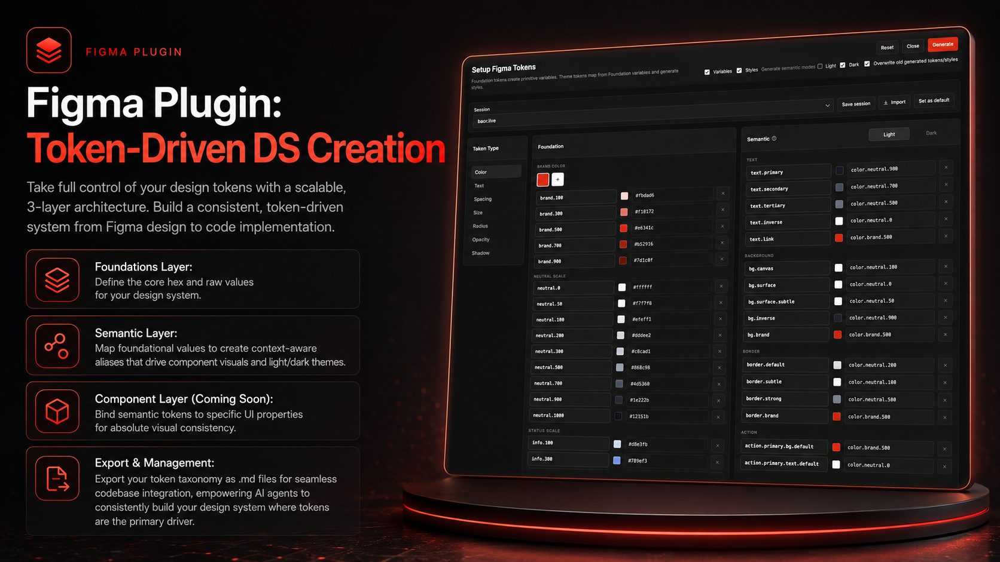

# Design System Token Importer

Design System Token Importer is a Figma development plugin for building local Variables and local Styles from a token-driven setup. It supports foundation primitives, semantic aliases, text styles, shadow styles, session management, and token import workflows so a design system can stay structured from setup through implementation.

## Main Contributor

**Bao Le** is the main contributor and primary maintainer of this project.

## License

This repository is available for **personal use only**. See [LICENSE](./LICENSE) for the full terms.

## Overview

The plugin turns a guided token setup or imported token JSON into:

- Local Figma Variables
- Local Paint Styles
- Local Text Styles
- Local Effect Styles

It is designed around two main token layers:

- **Foundation tokens** for primitive values such as color, spacing, size, radius, opacity, and typography.
- **Semantic tokens** for designer-facing aliases such as `color.bg.*`, `space.stack.*`, `size.control.*`, `shadow.*`, and `text.*`.

## Current Feature Set

Based on the current QA reference, the plugin supports:

- Guided setup for Foundation and Semantic token categories
- Figma Variable generation from token definitions
- Local Paint Style generation from semantic color tokens
- Local Text Style generation from semantic text tokens
- Local Effect Style generation from semantic shadow tokens
- Dashboard/token JSON import
- Session save, load, delete, import, and export
- Saved default setup
- Last active session restore on reopen
- Plugin window size persistence
- Light and Dark semantic color mode support
- Overwrite and prune behavior for previously generated variables and styles
- Variable aliasing from Semantic tokens to Foundation tokens
- Scoped variable visibility for cleaner Figma property pickers
- Figma font loading with fallbacks during text style generation
- Token suggestions for reference fields
- Brand/Foundation color picker workflows
- Inline status feedback for generate, reset, and session actions

## Token Categories

### Foundation Tokens

Foundation tokens create primitive values and are intentionally hidden from most property pickers through empty scopes.

- `color.*`
- `space.*`
- `size.*`
- `radius.*`
- `opacity.*`
- `font.family.*`
- `font.size.*`
- `font.weight.*`
- `font.lineHeight.*`
- `font.letterSpacing.*`
- `font.textTransform.*`

### Semantic Tokens

Semantic tokens are the designer-facing layer used in Figma.

- `color.text.*`
- `color.bg.*`
- `color.border.*`
- `color.action.*`
- `color.focus.*`
- `color.status.*`
- `space.inline.*`
- `space.stack.*`
- `space.inset.*`
- `space.layout.*`
- `space.control.*`
- `size.control.*`
- `size.icon.*`
- `size.touch.*`
- `size.avatar.*`
- `size.dialog.*`
- `size.layout.*`
- `radius.*`
- `opacity.*`
- `shadow.*`
- `text.*`

## Workflow

1. Open the plugin in Figma.
2. Configure Foundation and Semantic token values in the guided setup UI.
3. Choose generation options such as Variables, Styles, Light/Dark modes, and overwrite behavior.
4. Click `Generate` to create or update local Figma Variables and Styles.

The plugin also supports importing token JSON, saving sessions, exporting sessions, and restoring the most recent working setup.

## UI Structure

The current UI is organized as a desktop-style workspace with:

- A fixed header for generation, reset, sessions, import, defaults, and status feedback
- A left column for token category tabs
- A middle column for Foundation token editing
- A right column for Semantic token editing

Available categories include:

- Color
- Text
- Spacing
- Size
- Radius
- Opacity
- Shadow

## Import and Storage

The plugin supports:

- Guided setup import into generated token collections
- Dashboard JSON import
- Markdown session import/export
- JSON session import/export
- Persistent storage through `figma.clientStorage`

## Load In Figma

1. Open Figma.
2. Go to `Plugins > Development > Import plugin from manifest...`.
3. Select this repository's `manifest.json`.
4. Run `Design System Token Importer`.

## Repository Notes

- `code.js` handles the Figma plugin controller logic and API interactions.
- `ui.html` is the authoritative UI source.
- `ui.js` mirrors the UI logic and should stay in sync with `ui.html`.
- `QA.md` is the reference document for implemented behavior, QA coverage, and development rules.
